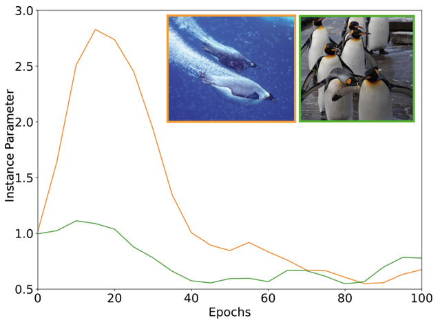
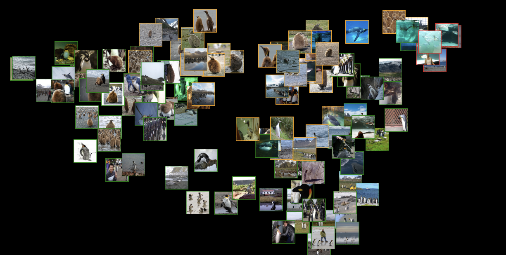

# Data Encrichment with Data Parameters
This repository contains the code for data-cleaning/enrichment using [Data Parameters](https://papers.nips.cc/paper/9289-data-parameters-a-new-family-of-parameters-for-learning-a-differentiable-curriculum).
The code in this repo is forked from the [open source]() implementation of Data Parameters, and is upgraded and modified to support data enrichment. To understand more about data parameters method you can read the paper
and README in the original repository. In this ReadMe, post setup and installation, we will detail a walkthrough/example of analyzing the popular ImageNet dataset.


## Setup and Requirements
This code was developed and tested on RunPod in the following environment:

- Ubuntu 22.04
- Python 3.10.12
- CUDA 11.8

Other requirements are mentioned in requirements.txt file. You can create a python virtual enviorment and install the dependencies there. **Important**: You need to register on hugging face with your email, and get approval to use ImageNet dataset. Once you do that, you can create an access token, which will be used to download ImageNet or other proprietary datasets. Most of the experiments were run on RunPod platform. You can create a persistent storage disk there, which can be attached to multiple instances. Using a persistent disk will help with keeping all the setup (including the virtual enviorment) preserved across sessions. A sample script to run after logging into runpod instance is provided [here](./shell_scripts/runpod_setup.sh). You can use RTXA4000 or RTXA4500 GPUs to optimize the run-time vs cost of renting tradeoff on runpod. Both of them cost around 0.34$/hour.

### Data Cleaning CIFAR100 40% noisy labels
In this section, we will provide you scripts for reproducing results of CIFAR100-40% noisy task. In this setup, we corrupt 40% of CIFAR100 dataset by changing their labels. 
Our goal is to detect these noisy/mislabelled samples automatically. [cifar_dataset.py](dataset/cifar_dataset.py) extends the standard CIFAR100 dataset from torchvision to allow corruption
of a subset of data with uniform label swap.

#### Baseline 
```
python main_cifar.py \
  --rand_fraction 0.4 \
  --exp_prefix 'baseline_40frac_corrupt' \
  --restart
```
This command trains WideResNet28_10 architecture on CIFAR100 dataset (corruption rate=40%) without data parameters. 
This experiment can be used to obtain baseline performance without data parameters. Running this script, you should obtain 50.0% accuracy at convergence.

#### Train with instance level parameters
Since the noise present in the dataset is at instance level, we can train the DNN model with instance level parameters
to learn instance specific curriculum. The curriculum should learn to ignore learning from corrupt samples in the dataset.
```
python main_cifar.py \
  --rand_fraction 0.4 \
  --init_inst_param 1.0 \
  --lr_inst_param 0.2 \
  --wd_inst_param 0.0 \
  --learn_inst_parameters \
  --exp_prefix 'corrupt_label/with_inst_params_lr_0.2_40frac_corrupt_labels' \
  --restart
```
Running this script, using instance level parameters, you should obtain 71% accuracy @ 84th epoch. 
For results on noisy datasets, we always perform early stopping at 84th epoch (set by cross-validation).


#### Identifying noisy-corrupt samples automatically
When we train with instance level data parameters, for each data point in the dataset, we learn a parameter (instance level data parameter). 
During training, we save these instance-level values after every epoch. Probability of a sample being noisy/ mislabelled is proportional to the value of data parameter. With this heuristic in mind, to automatically extract the nosiy mislabelled samples, we can inspect the instance-level data parameters at the end of training (or an epoch at which validation accuracy had peaked) and sort them by the data-parameter value, and extract the indices for the top-k fraction of dataset.

#### Training after removal of noisy samples
We can also re-train our model by automatically removing the corrupt samples from dataset. To do this, we just need to specify the saved_artifact containing the instance-level data parameters. For example, in the code below, we are going to train with only 60% (subset_frac) of training data. The 40% of data that we discard, is going to be computed from the instance-level data parameters saved in 'dataset_subset_ckpt'.

```
python main_cifar.py \
  --rand_fraction 0.4 \
  --exp_prefix 'filtered_with_epoch_80_40frac_corrupt' \
  --dataset_subset_ckpt 'weights_CL/cifar100/with_inst_params_lr_0.2_40frac_corrupt/epoch_80.pth.tar' \
  --subset_frac 0.60 \
  --restart
```


### ImageNet - Data Enrichment Analysis
In this section we are going to demonstrate how this tool can be used for analyzing the various classes present in the dataset automatically. 
**Note**: To run this section, you need to ensure you have hugging-face account and token to download ImageNet dataset. First time you will run this script, it will take an hour to download the entire the entire ImageNet. But successive calls will use the cached dataset.


#### Baseline 
First step is to validate the ImageNet setup. 
```
python main_imagenet.py \
  --arch 'resnet18' \
  --exp_prefix 'baseline_lr_0.1_wd_1e-4' \
  --restart
```
This command will train ResNet18 architecture on ImageNet dataset without data parameters. This experiment can be used to obtain baseline performance without data parameters. Running this script, you should obtain 70.2% accuracy on validation @ 100 epoch.


#### Training with instance-level parameters
Since we are interested in instance level analysis, we wil now train on ImageNet dataset with Instance level parameters. To train ResNet18 with instance-level data parameters you can use this command:
```
python main_imagenet.py \
  --arch 'resnet18' \
  --lr_inst_param 0.8 \
  --wd_inst_param 1e-8 \
  --learn_inst_parameters \
  --exp_prefix 'with_inst_params_lr_0.8_wd_1e-8' \
  --restart
```
This command will train with instance-level data-parameters. We have set two more hyper-parameters: 'lr_inst_param' and 'wd_inst_param'. Generally speaking, instance level learning rate can be higher than model parameters learning rate (e.g. it is 0.1 by default.)


##### Auto classification/ analysis of ImageNet
Once the training is complete, we will have all the training artifacts saved in the checkpoint folder. The training artifacts contain instance-level data parameters saved at every epoch. To analyze the training dataset, we are going to analyze the temporal trajectory of the data parameters. The figure below shows the temporal trajectory of instance-level data parameters for two instances.


Our tool labels the training data points into three categories: **'easy'**, **'hard/outliers'** and **'need review'**. 
If our use case is to **auto-clean the dataset** (no human intervention), then we can just re-train with 'easy' samples.  For **enriching the dataset**, we will rely on manual verification. More specifically, instances labelled as 'need review' or 'outlier' can be re-labelled/verified by annotator.

There are two kind of visualizations which can be auto-created for qualitative inspection. Both of these visulizations are per class, i.e. we analyze one class at a time. **The label of the instance can be inferred by the border-color of the image**. Easy-labelled images have **<span style="color:green">green</span>**, Hard-labelled images have **<span style="color:red">red</span>** and Need review-labelled images have **<span style="color:orange">orange</span>** border.


- **Easy vs Hard vs Need Review**: In this visualization we plot the few representative samples of the easy, hard samples, and samples which need review as three rows. This is the most preferred or easy way of presenting analysis to a client. To perform this analysis you can run:
```
python ./auto_analysis/easy_hard_and_need_review.py 
```
In this script, you need to set the 'analysis_dir" to the checkpoint folder of the run. Sample output of this script for the **Penguin** class is shown below:


- **TSNE Plots**: In this visualization we plot all the images in a class as a scatter plot. Scatter plot is obtained by running T-SNE analysis on the temporal instance-level data parameter value. Essentialy, if we trained the model for K epochs, for each data point, we will have a K instance-level data parameter value. T-SNE analysis converts this K-dimensional representation to a 2D representation for visualization, while ensuring the points similar in the K-dimensional space are plotted close to each other in 2D space. Therefore, you can see points which are classified as easy, hard or need-review are well clustered in this view. To perform this analysis you can run:
```
python ./auto_analysis/tsne_plots.py 
```
In this script, you need to set the 'analysis_dir" to the checkpoint folder of the run. Sample output of this script for the **Penguin** class is shown below:



#### Qualitative Analysis
Qualitative analysis of visulization output from our tool can **quickly reveal sub-categories in the dataset** which might be under-represented. For example, in the "Penguin" class analyzed above, most images are of Penguin walking on a surface and are hence classified as easy. However, there is a subset of data, which is under-represented and is marked as an outlier (penguin under water) or need-review (baby penguin in brown fur). 

## Miscellaneous
- To analyze ImageNet using CleanLab Studio, we need to convert it into a folder structure which is accepted by CleanLab.
'dump_imagenet.py' file converts our locally downloaded ImageNet dataset into a format suitable for uploading to CleanLab.
