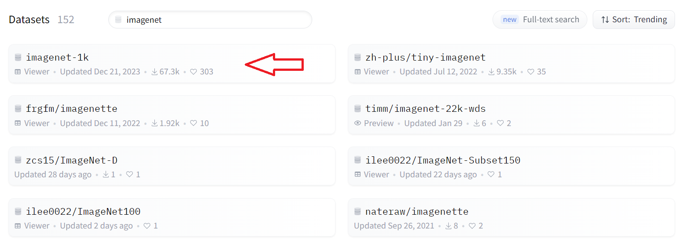
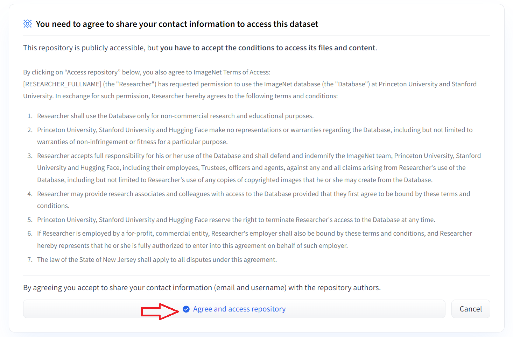

## Getting started
This code was developed and tested on RunPod. Although similar configuration on Windows will work as well.

#### Requirements
- Ubuntu 22.04
- Python 3.10
- CUDA 11.8

Start by creating a Python virtual environment. Then you can run

```bash
pip install -r requirements.txt
```

 **Important**: You need to have a [Hugging Face](https://huggingface.co/), and request access to the ImageNet dataset. Simply log-in to Hugging Face, go to the Datasets page and search for ImageNet. 
 
 Once you do that, you can create an access token, which will be used to download ImageNet or other proprietary datasets.
  

Most of the experiments were run on RunPod platform. You can create a persistent storage disk, which can be attached to multiple instances. Using a persistent disk will help with keeping all the setup (including the virtual enviorment) preserved across sessions. A sample script to run after logging into runpod instance is provided [here](../runpod_setup.sh). You can use RTXA4000 or RTXA4500 GPUs to optimize the run-time vs cost of renting tradeoff on runpod. Both of them cost around 0.34$/hour.

The repository can also be run locally, in which case you will need a CUDA capable GPU. We suggest an anaconda virtual environment for localy development. Install [anaconda](https://www.anaconda.com/) and simply run:

```bash
conda create -n myenv python=3.10
```